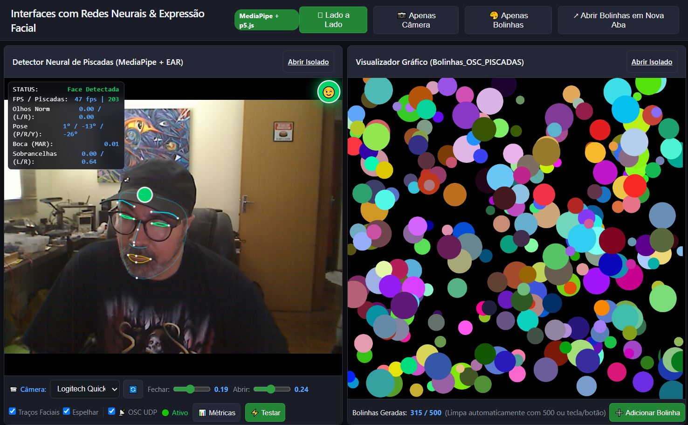

# Interfaces com Redes Neurais e Expressão Facial - Web (MediaPipe + p5.js)

Esta aplicação é a migração e evolução para ambiente Web do projeto original [**Interfaces com Redes Neurais e Expressão Facial**](https://github.com/LAC-EBA-UFMG/Interfaces_com_Redes_Neurais_e_Expressao_Facial)

A versão original utilizava Python, OpenCV, ONNX (RFB-320 e PFLD) e enviava mensagens UDP/OSC (`/piscou`) para um sketch em Java no Processing (`Bolinhas_OSC_PISCADAS.pde`).

Nesta versão Web, tudo roda 100% no navegador (Client-Side), sem a necessidade de instalar Python, drivers de câmera locais ou bibliotecas nativas.



🔗 **Acesse a aplicação online no GitHub Pages:**  
👉 [https://sandrobenigno.github.io/Interfaces_com_Redes_Neurais_e_Expressao_Facial_WEB/](https://sandrobenigno.github.io/Interfaces_com_Redes_Neurais_e_Expressao_Facial_WEB/)

---

## 🚀 Funcionalidades

- **MediaPipe Face Mesh em Tempo Real**: Rastreia 468 marcos faciais com aceleração por WebAssembly e WebGL.
- **Cálculo Fiel de EAR (Eye Aspect Ratio)**:
  - Implementa a equação euclidiana de Soukupová & Cech nos pontos oculares originais.
  - Máquina de estados com **histerese** (`setP_fechar` e `setP_abrir`) ajustáveis por controles deslizantes na interface.
- **Port do Sketch das Bolinhas (`Bolinhas_OSC_PISCADAS`)**:
  - Reescrito em **p5.js**.
  - Mantém a estética original: tela preta, bolinhas coloridas sorteadas a cada piscada, contagem até 500 para limpeza automática e reset por tecla ou clique.
- **Arquitetura Desacoplada estilo OSC**:
  - Comunicação entre iframes, abas e janelas via **`BroadcastChannel`** e fallback para **`window.postMessage`**.
  - Permite rodar os dois módulos em iframes na mesma tela (Split View) ou até mesmo em monitores diferentes (abrindo a tela de bolinhas em uma janela pop-up separada).
- **Compatível com GitHub Pages**: Totalmente estático, bastando habilitar o Pages na branch do repositório.

---

## 📁 Estrutura do Projeto

```text
Interfaces_com_Redes_Neurais_e_Expressao_Facial_WEB/
├── index.html               # Página mestre (Layout responsivo com iframes e alternância de views)
├── detector.html            # Módulo de visão: Câmera + MediaPipe + HUD do EAR + Calibração
├── bolinhas.html            # Módulo gráfico: Sketch das Bolinhas em p5.js
├── css/
│   └── style.css            # Tema escuro, layout em grid, HUD de depuração e controles
├── js/
│   ├── ear_detector.js      # Lógica matemática de EAR e histerese da piscada
│   ├── event_bus.js         # Barramento de eventos (substituto web do protocolo OSC)
│   └── bolinhas_sketch.js   # Sketch p5.js que gera círculos aleatórios a cada /piscou
└── README.md
```

---

## 💻 Como Rodar Localmente

Devido às políticas de segurança do navegador para permissão de câmera (`getUserMedia`), as páginas com webcam precisam rodar em `localhost` ou sob `https://`.

Para rodar localmente, execute um servidor HTTP simples no terminal dentro desta pasta:

### Com Python:
```bash
python -m http.server 8080
```
Depois, abra no navegador: [http://localhost:8080](http://localhost:8080)

### Com Node.js / npx:
```bash
npx serve .
```

---

## ⌨️ Atalhos e Interações

- **Teclado (em qualquer tela)**: Pressionar qualquer tecla limpa a tela de bolinhas (reseta a contagem).
- **Botão "⚡ Testar Piscada"**: Simula o recebimento do sinal `/piscou` sem precisar piscar os olhos (útil para testes rápidos).
- **Botão "↗ Abrir Bolinhas em Nova Aba"**: Abre o sketch em uma janela separada. Por usar `BroadcastChannel`, as piscadas capturadas na câmera continuam alimentando as bolinhas na outra janela/monitor em tempo real!
